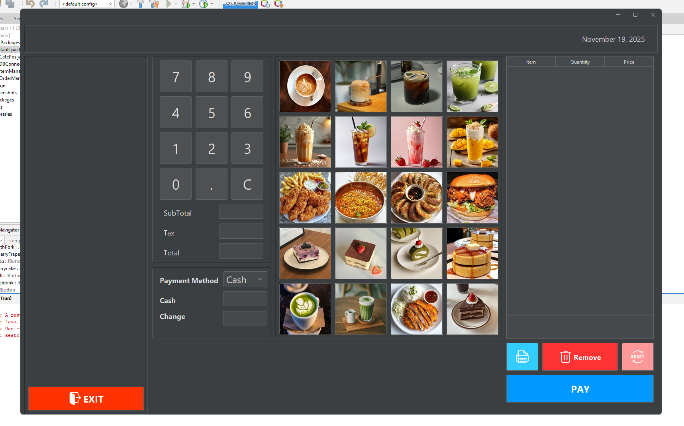

# JavaCafePos

A simple Java-based Point of Sale (POS) system for cafes.  
It supports adding items, calculating totals, and generating professional PDF receipts.

---

## Current Work

Here is a preview of the application in its current state:



*Screenshot shows the main UI with item table and PDF receipt generation.*

---

## Features

- Add menu items and quantities into a table.  
- Automatically compute totals.  
- Generate professional **PDF receipts** using Apache PDFBox.  
- Fully centered receipt layout with Courier font.  
- Easy to modify receipt layout, add logo, or change styling.

---

## Requirements

- Java 8 or higher  
- Apache PDFBox library (`pdfbox-<version>.jar` and `fontbox-<version>.jar`)  

---

## Setup & Usage

1. Clone the repository:

```bash
git clone https://github.com/Jumnert/JavaCafePos.git
