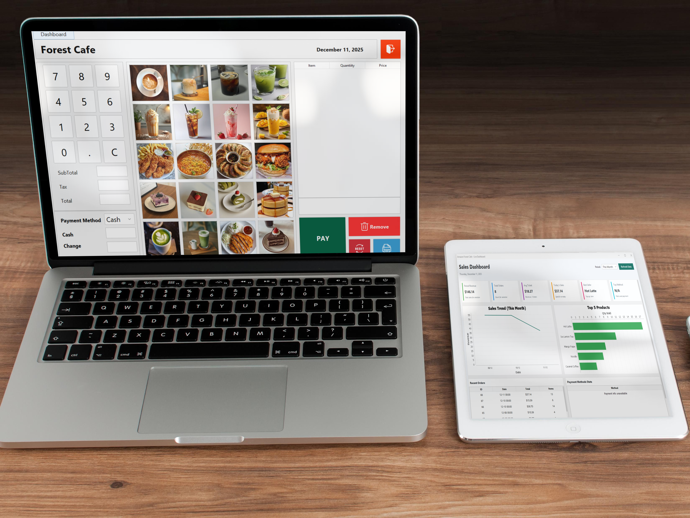

# JavaCafePos

A simple Java-based Point of Sale (POS) system for cafes.  
It supports adding items, calculating totals, and generating professional PDF receipts.

---

## Current Worker(Finished)

Here is a preview of the application in its current state(Finished):



*Screenshot shows the main UI with item table and PDF receipt generation.*

---

## Features

- Add menu items and quantities into a table.  
- Automatically compute totals.  
- Generate professional **PDF receipts via web** using Apache PDFBox.  
- Fully centered receipt layout with Courier font.  
- Easy to modify receipt layout, add logo, or change styling.
- Graph-System
  

---

## Requirements

- Java 8 or higher  
- Libaries/Jar Requirement (`pdfbox-2.0.35>.jar`,`fontbox-2.0.35.jar`,`pdfbox-tool-2.0.35.jar`,`mysql-connector-j-9.5.0.jar`,`flatlaf-3.6.2.jar`,`commons-logging-1.3.5.jar`,`jcommon0-1.0.23.jar`)  

---  

## Setup & Usage

##Clone the repository:

```bash
git clone https://github.com/Jumnert/JavaCafePos.git
